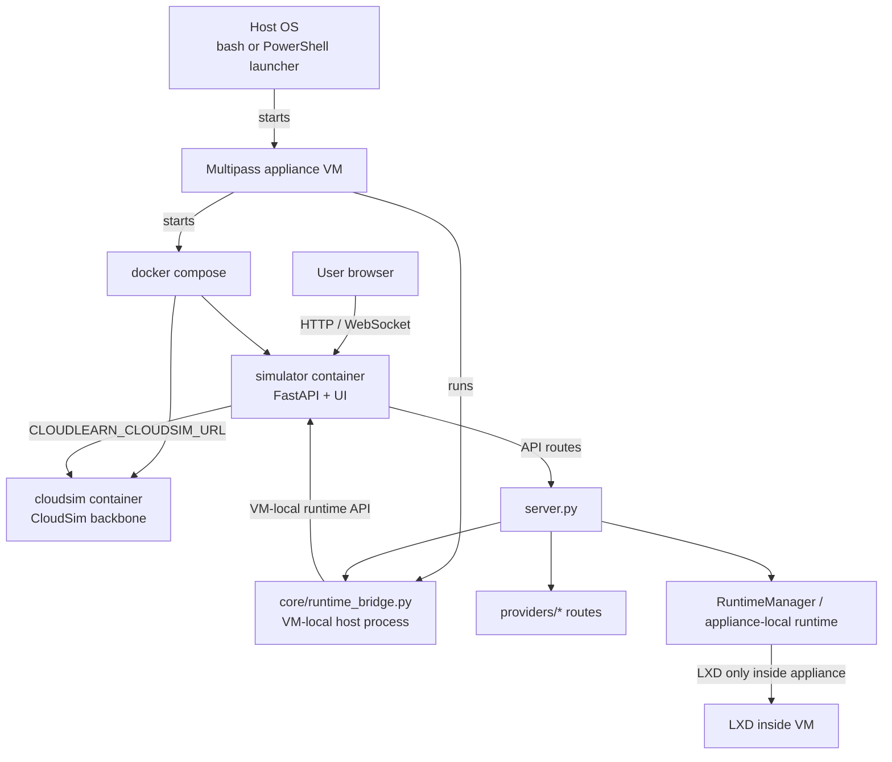
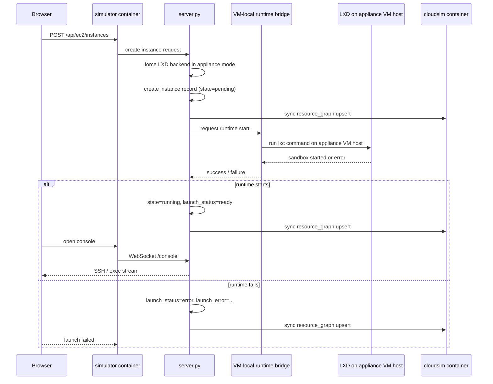

# Service Spawn Diagram

This document shows how Cloud Learn starts, how the simulator and CloudSim containers fit together, and how EC2 sandboxes are launched inside the appliance VM.

## Startup Flow

## EC2 Launch Sequence

## Component Responsibilities

- `scripts/cloud-learn` and `scripts/cloud-learn.ps1` run on the host OS and launch the appliance VM.
- The appliance VM runs the inner launcher and starts the VM-local runtime bridge.
- `core/runtime_bridge.py` runs on the appliance VM host and executes `lxc`.
- `simulator` is the API and UI container inside the VM.
- `cloudsim` is the simulation backbone container inside the VM.
- `server.py` orchestrates provider APIs and runtime launches.
- `providers/*` hold provider-specific route modules.

## Notes

- EC2 sandboxes are launched inside the appliance VM, not on the laptop host OS.
- Appliance mode uses LXD only for EC2, regardless of the laptop host OS.
- If the VM-local bridge is unreachable, EC2 launches remain pending and the launch status is marked as an error.
